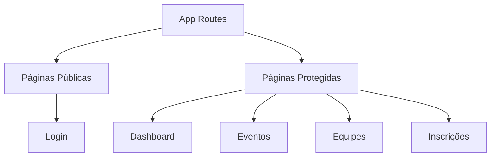

# Tropa Digital - Dashboard

Um dashboard moderno e responsivo construído com Next.js 14

## 📋 Índice

- Visão Geral
- Tecnologias
- Estrutura do Projeto
- Autenticação
- Responsividade
- Rotas

## 🎯 Visão Geral

Este projeto é um dashboard administrativo que demonstra várias funcionalidades essenciais para aplicações web modernas, incluindo autenticação, navegação responsiva e gerenciamento de estado.

## 🚀 Tecnologias

- Next.js 14
- React
- TypeScript
- SASS Modules
- LocalStorage para simulação de autenticação

### 🔐 Autenticação Simulada

```
graph LR
    A[Login Page] --> B{Verificar Credenciais}
    B -->|Válido| C[Dashboard]
    B -->|Inválido| D[Erro de Login]
    C --> E[Logout]
    E --> A
```

- Sistema de login simulado usando LocalStorage
- Credenciais de teste:
  - Email: kayquesteck@tropadigital.com
  - Senha: kayquesteck
- Persistência de sessão
- Logout com limpeza de dados

### 📱 Responsividade

```
graph TD
    A[Layout Responsivo] --> B[Desktop]
    A --> C[Mobile]
    C --> D[Menu Retrátil]
    D --> E[Botão Toggle]
    D --> F[Animação Suave]
```

- Design adaptativo para todas as telas
- Sidebar retrátil em dispositivos móveis
- Transições suaves
- Layout otimizado para diferentes resoluções

### 📄 Paginação Dinâmica

```
graph LR
    A[Lista de Itens] --> B[Paginação]
    B --> C[Itens por Página]
    B --> D[Navegação]
    D --> E[Próxima Página]
    D --> F[Página Anterior]
```

- Paginação client-side
- Controle de itens por página
- Navegação intuitiva

### 🔄 Roteamento



- Rotas protegidas
- Redirecionamento automático
- Navegação dinâmica

## 📁 Estrutura do Projeto

```
src/
├── app/
│   ├── (admin)/           # Rotas protegidas
│   │   ├── dashboard/     # Página principal
│   │   ├── events/        # Gerenciamento de eventos
│   │   └── teams/         # Gerenciamento de equipes
│   ├── services/
│   │   └── auth.ts        # Serviço de autenticação
│   ├── styles/            # Estilos globais
│   └── sign-in/           # Página de login
└── assets/                # Ícones e imagens
```

## 🔒 Autenticação

O sistema utiliza uma simulação de autenticação com LocalStorage:

```
interface User {
  name: string
  email: string
  photo_url: string
}

interface AuthState {
  user: User
  token: string
}
```

## 📱 Responsividade

O projeto utiliza SASS Modules com Media Queries para garantir uma experiência consistente em diferentes dispositivos:

```
@media (max-width: 768px) {
  .container {
    position: fixed;
    transform: translateX(-100%);
    
    &.open {
      transform: translateX(0);
    }
  }
}
```

## 🛣️ Rotas

- /sign-in - Página de login
- /dashboard - Visão geral
- /events - Gerenciamento de eventos
- /teams - Gerenciamento de equipes
- /registrations - Gerenciamento de inscrições
  Cada rota é protegida e requer autenticação para acesso.

## 🎨 Temas e Estilos

O projeto utiliza variáveis CSS para manter consistência visual:

```
:root {
  --accent: #cc6237;
  --background: #f5f5f5;
  --text: #252525;
}
```

## 🔄 Estado Global

O estado da autenticação é gerenciado através do LocalStorage e hooks do React:

```
const [user, setUser] = useState<User | null>(null);
const [isLoading, setIsLoading] = useState(true);
```

## 📦 Como Executar

1. Clone o repositório
2. Instale as dependências:

```
npm install
```

3. Inicie o servidor de desenvolvimento:

```
npm run dev
```

4. Acesse http://localhost:3000

## 🤝 Contribuição

Contribuições são sempre bem-vindas! Sinta-se à vontade para abrir uma issue ou enviar um pull request.

## 📝 Licença

Este projeto está sob a licença MIT. Veja o arquivo LICENSE para mais detalhes.
